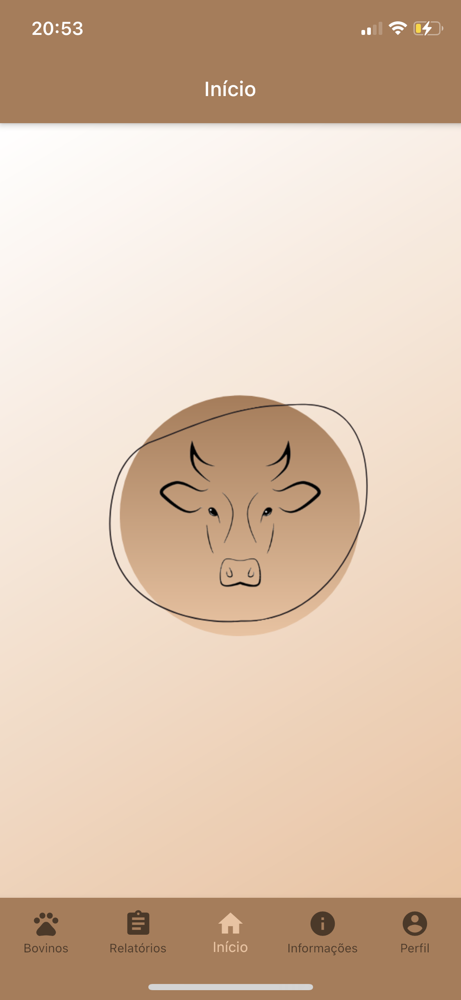
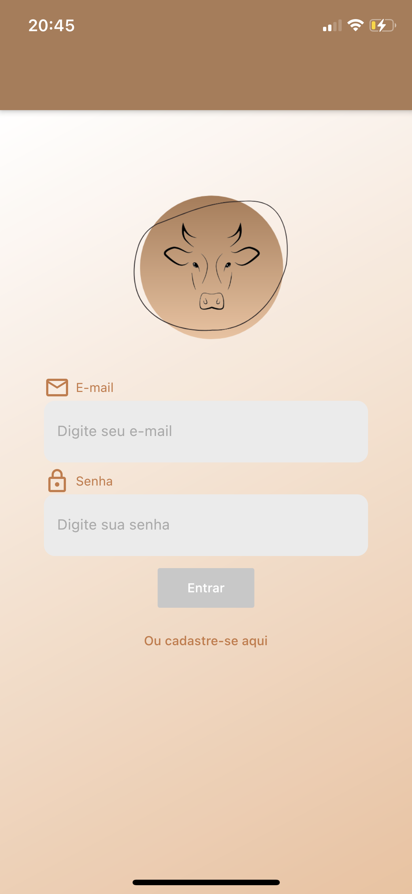
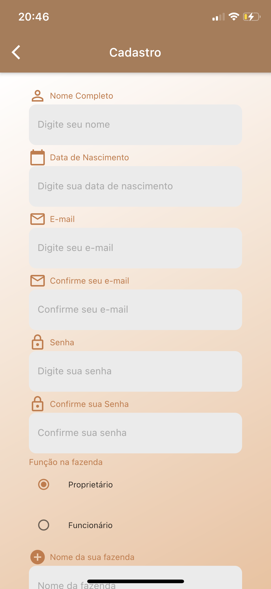
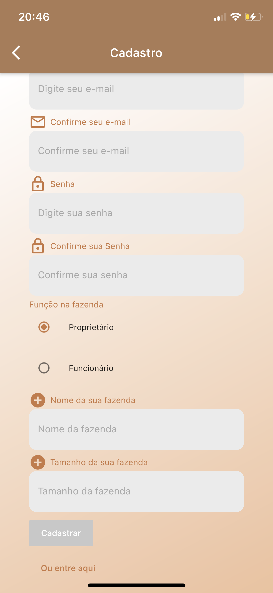
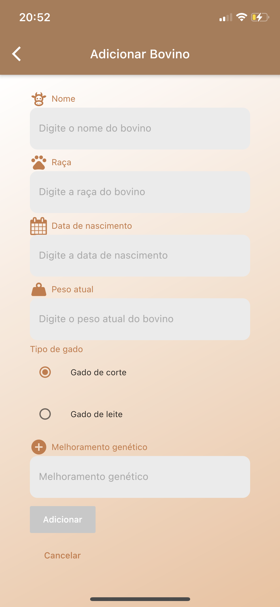
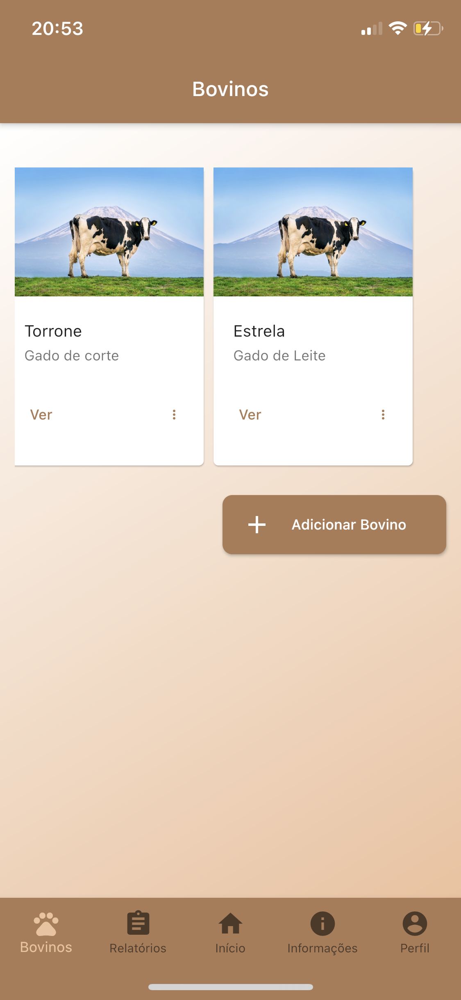
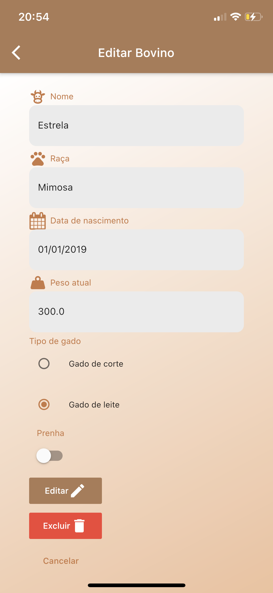
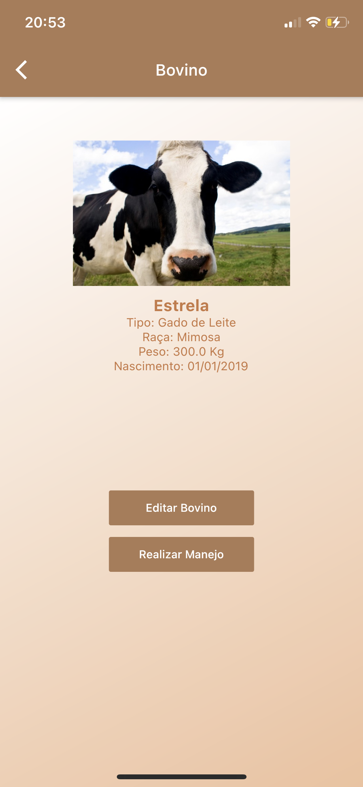
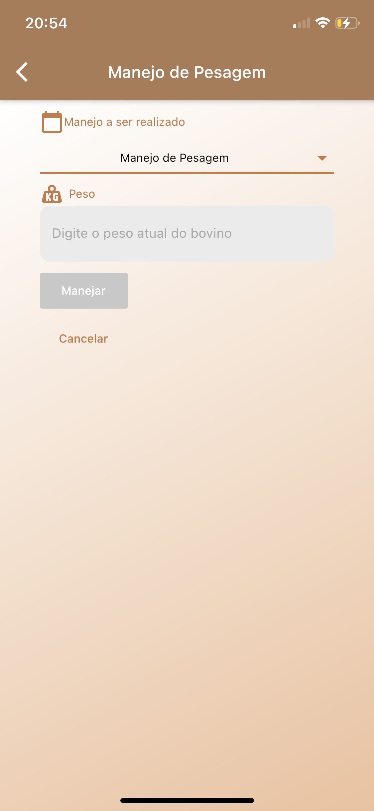
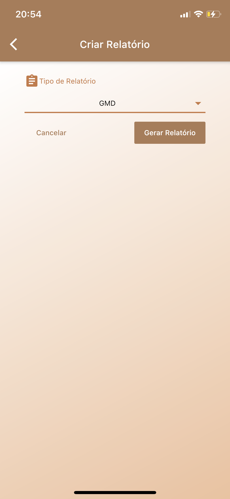

# iGado

**Número da Lista**: 13 
**Código da Disciplina**: FGA0208-T01 

## Alunos
|Matrícula | Aluno | Git |
| :-: | :-- | :-- |
| 16/0133394 | Lucas Fellipe Carvalho Moreira| [@lucasfcm9](https://github.com/lucasfcm9) | 
| 17/0145514 | Iuri de Souza Severo Alves| [@iurisevero](https://github.com/iurisevero) | 
| 17/0129411 | Guilherme Mendes Pereira | [@guilherme-mendes](https://github.com/guilherme-mendes) | 
| 17/0138798 | Caio Vinícius Fernandes de Araújo | [@caiovfernandes](https://github.com/caiovfernandes) | 
| 17/0013910 | João Pedro José Santos da Silva Guedes | [@sudjoao](https://github.com/sudjoao) | 

## Sobre 
Repositório destinado à disciplina de Arquitetura & Desenho de Software da Universidade de Brasília acerca do aplicativo iGado. O aplicativo iGado visa contribuir para o gerenciamento e gestão dos bovinos que se concentram em propriedades rurais. Nele será possível coletar informações dos bovinos e seus respectivos manejos. Também será possível ter um controle financeiro sobre os gastos e lucros advindos da fazenda e um maior controle do estoque de insumos. Além disso, o aplicativo terá a opção de extrair relatórios com índices e métricas definidas pelo usuário, com o inituito de facilitar tomadas de decisão além de gerar uma produtividade mais eficaz.

## Screenshots

  
  

  
  

  
  

  
  

  
  

  
  

  
  

## Instalação 
**Linguagens**: Dart e Python 
**Tecnologias**: Flutter, Flask, Docker e Postgresql 

Tutorial para executar o app disponível nos repositórios:

- [Frontend](https://github.com/UnBArqDsw/2020.1_G13_iGado_Frontend)
- [Backend](https://github.com/UnBArqDsw/2020.1_G13_iGado_Backend)

## Vídeo

[Vídeo explicando sobre todo o projeto](https://youtu.be/ixYGB5ssLQs)
