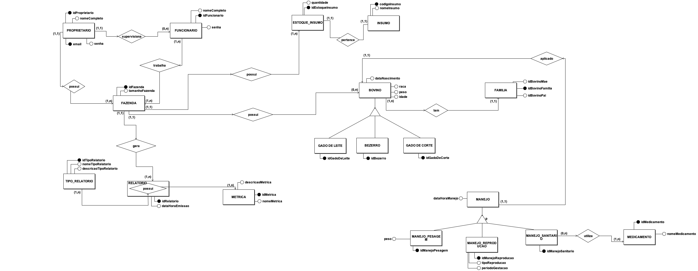

# Diagramas de Banco de Dados

|    Data    | Versão |                Descrição                |                     Autor                     |
| :--------: | :----: | :-------------------------------------: | :-------------------------------------------: |
| 20/09/2020 |  0.1   | Criação do documento do <i>Diagrama de Entidade-Relacionamento</i> (DE-R) inicial | [Caio Vinícius](https://github.com/caiovfernandes) e [Lucas Fellipe](https://github.com/lucasfcm9) |

## Diagrama de Entidade Relacionamento

 &emsp;&emsp; Um <i>Diagram de Entidade-Relacionamento (DER)</i> é um tipo de fluxograma que ilustra como “entidades”, como Pessoas, objetos ou conceitos, se relacionam entre si dentro de um sistema. Diagramas de Entidade Relacionamento são mais utilizados para projetar ou depurar bancos de dados relacionais nas áreas de engenharia de software. Também conhecidos como DERs, ou modelos ER, usam um conjunto definido de símbolos, tais como retângulos, diamantes, ovais e linhas de conexão para representar a interconectividade de entidades, relacionamentos e seus atributos. Eles espelham estruturas gramaticais, onde entidades são substantivos e relacionamentos são verbos.
O objetivo da modelagem de dados é possibilitar a apresentação de uma visão única não redundante e resumida dos dados de um problema. Também nos ajuda a entender a estrutura e o significado destes dados.

 

**Autor(es):** [Lucas Fellipe](https://github.com/lucasfcm9) e [Caio Vinícius](https://github.com/caiovfernandes)

## Referências
O que é um diagrama entidade relacionamento. Disponível em: <https://www.lucidchart.com/pages/pt/o-que-e-diagrama-entidade-relacionamento#discovery__top>. Acesso em 20 set. 2020

RODRIGUES, Joel. Modelo Entidade Relacionamento (MER) e Diagrama Entidade-Relacionamento (DER). Disponível em: https://www.devmedia.com.br/<modelo-entidade-relacionamento-mer-e-diagrama-entidade-relacionamento-der/14332>. Acesso: 20 set. 2010.